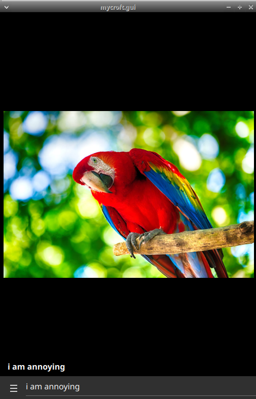

#  Parrot 

Turn Mycroft into a echoing parrot!

Make Mycroft repeat whatever you want

## About 

Turn Mycroft into a parrot. Speak a phrase and listen to it repeated in Mycroft's selected voice.

    "Hey Mycroft, start parrot"
    "hello"
    hello
    "what"
    what
    "who are you"
    who are you
    "Stop parrot"

NOTE: This will blacklist and replace official mycroft-speak skill, see [Issue#24](https://github.com/MycroftAI/skill-speak/issues/24)

## Examples 

* "say Goodnight, Gracie"
* "repeat Once upon a midnight dreary, while I pondered, weak and weary, Over many a quaint and curious volume of forgotten lore"
* "speak I can say anything you'd like!"
* "start parrot"
* "stop parrot"

## Credits 
JarbasAl

## Category
**Entertainment**

## Tags
#parrot
#converse
#echo
#Template
#Tutorial
